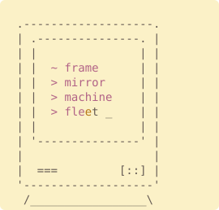

**frame**: a mirror of `~`, the machine's setup as data, and a fleet of claude agents that keep it
all moving.

<p align="center">
  <a href="https://github.com/dvakatsiienko/frame/actions/workflows/ci.yml"></a>
  
  
  <a href="LICENSE"></a>
</p>

<p align="center">
  
  
</p>

- [mirror](#mirror) — `home/` is `~`
- [machine](#machine) — brew, defaults, launchd
- [fleet](#fleet) — skills, memory, sline, hotkeys
- [link it](#link-it)

<br clear="right">

## mirror

a path under `home/` is the same path under `~`. the link map is derived by walking the tree, never
kept by hand, so adding a file to `home/` is the whole act of tracking it.

```bash
pnpm frame:link                        # status
pnpm frame:link apply                  # link everything not linked yet
pnpm frame:link register ~/.foo        # move a file into the mirror and link it back
pnpm frame:link untrack ~/.gitconfig   # hand a file back to ~
```

## machine

the mac's setup is kept as data, because data does not rot and scripts do: the `Brewfile`, the
macos defaults, the `duti` file bindings, and the launchd jobs under `schedule/`.

```bash
pnpm macos:setup   # brew bundle, macos defaults, duti, vim-plug
```

## fleet

`home/.claude/` is the claude code setup every session on this mac reads: rules, skills
(`plugin-x`), hooks, output styles, and `sline`, the statusline. `cclio/` is the coordinator's
home, the session that plans and routes work to background coders. `hotkeys/` maps every
keyboard chord on the machine and serves `chords`, the map's app.

## link it

on a fresh mac, by hand first: [brew](https://brew.sh/), then `fnm` and `pnpm` through brew, then
node 24 through `fnm`. then:

```bash
pnpm i
pnpm macos:setup
pnpm frame:link apply
```
