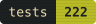
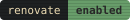
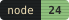
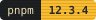
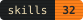
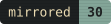
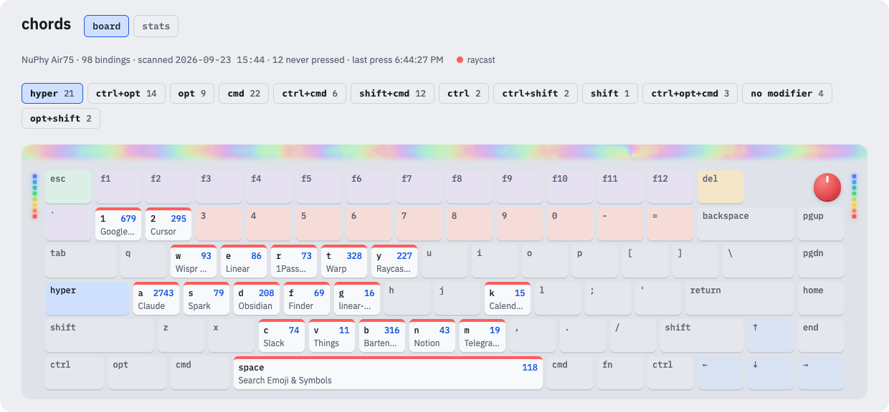
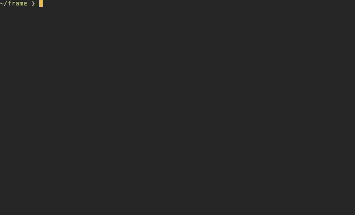

🎞️ the **frame**: a place where most of the machine's setup lives as data.

<p align="center">
  <a href="https://github.com/dvakatsiienko/frame/actions/workflows/ci.yml"></a>
  
  
  
  
  
  
</p>

<p align="center">
  
  
</p>
<br>

### 🧭 toc

- [fleet](#-fleet) — skills, memory, sline, hotkeys
- [chords](#-chords) — the keyboard map, live
- [mirror](#-mirror) — `home/` is `~`
- [machine](#-machine) — brew, defaults, launchd
- [link it](#-link-it) — a fresh mac install

<br clear="right">

## 🛸 fleet

`home/.claude/` is the claude code setup every session reads: memories, rules, skills
(`plugin-x`), hooks, output styles, and `sline`, the statusline.
`cclio/` is the coordinator's home, the session that plans and routes work to background coders.
`hotkeys/` maps every keyboard chord on the machine and serves `chords`, the map's app.



## 🎹 chords

chords is a keyboard map app: every key binding on every modifier layer, how often each one
fires, and which keys are still free. powered by launchd daemon that counts key presses.



## 🪞 mirror

the `mirror` links dotfiles and configs. a path under `home/` is the same path under `~`.
the link map is derived by walking the tree, so adding a file to `home/` auto-tracks it.

```bash
pnpm frame:link                        # status
pnpm frame:link apply                  # link everything not linked yet
pnpm frame:link register ~/.foo        # move a file into the mirror and link it back
pnpm frame:link untrack ~/.gitconfig   # hand a file back to ~
```



## 💻 machine

the mac's setup is kept as data, because data does not rot and scripts do: the `Brewfile`, the
macos defaults, the `duti` file bindings, and the launchd jobs under `schedule/`.

```bash
pnpm macos:setup   # brew bundle, macos defaults, duti, vim-plug
```

## 🔗 link it

on a fresh machine, by hand:
1. [brew](https://brew.sh/)
2. `fnm` and `pnpm` through `brew`
3. then `node 24` through `fnm`
4. then:

```bash
pnpm i
pnpm macos:setup
pnpm frame:link apply
```
